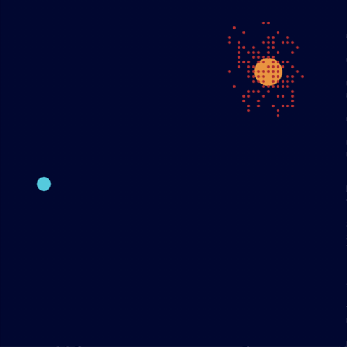
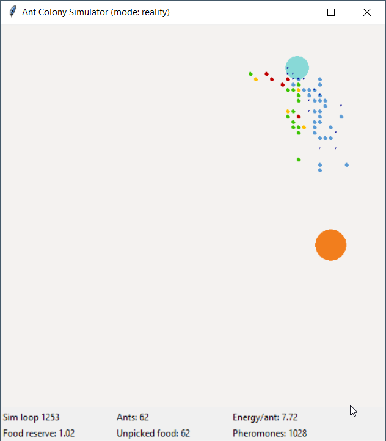

# 🐜 Colony Ant Simulator

This is a program designed to simulate the behavior of ants using Python 3.

## 📖 Overview

- Simulation Modes: The program offers two simulation modes: "theory" and "reality." In the "reality" mode, ants consume energy, and new ants are generated if there is enough food.

- Movement and Energy: Ants move based on predefined movement patterns and have energy levels. Ants lose energy over time, and their movement is influenced by their energy.

- Ant Behavior Simulation: The program simulates the behavior of ants in an environment, where ants move around randomly, search for food, and return to the nest.

## 🐜 Explanation of the Ants' behaviour.

- If the scout (also refered to as an ant) discovers a food source, it returns somewhat directly to the nest, leaving a trail of pheromones on it's way
     - These pheromones attract other ants, causing them to follow the trail
     - When ants return to the nest they reinforce the trail with more pheromones.

- When two paths lead to the same food source, the shorter one is used by more scouts compared to the longer path.
     - This causes the short path to become increasingly reinforced and attractive.
     - Over time, the pheromones on the long path evaporate, causing it to disappear.
     - Eventually, ants will only use the shortest path.

## ⚙️ Running the Program, and Setting Parameters.

> **ⓘ Note**\
> At the moment this program can't run, it seems that the current dependencies prevent the program from launching.

To Install the program, use the following command.
```bash
git clone https://github.com/riiswa/colony-ant-simulator
cd ~/colony-ant-simulator/

```
To launch the program, use the following command. By default, the game starts in "Theory" mode, think of it as "Arcade" mode:

```bash
python3 colony_ant_simulator.py
```
You can switch to "Reality" mode with the following command, think of "Reality" mode as "Realism" mode:

```bash
python3 colony_ant_simulator.py -m reality
```

For help with the options use the -h flag:

```bash
usage: python3 colony_ant_simulator.py [-h] [-m [{theory,reality}]] [n_ants]

Simulation of ants colony in python.

positional arguments:
  n_ants                Number of ants (recommended: 10-100; default: random number between 10 and 100)

options:
  -h, --help            Show this help message and exit
  -m [{theory,reality}] Simulation mode (default: "theory")
```

## 📸 Screenshots

The Algorithm in action:




## 🛠️  Prerequisites

- [Python 3.11](https://www.python.org/downloads/)
- Coloraide, install with the command `pip install coloraide`
- Tkinter, install with the command `sudo apt-get install python3-tk` (Sorry non-Ubuntu people!)
- Tomllib, install with the command `pip install tomllib` (Unable to install)
