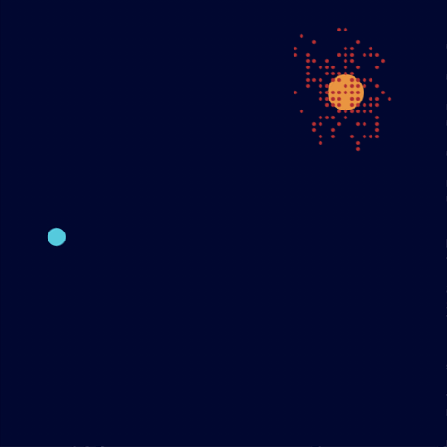

# colony-ant-simulator

Simulation of ants colony in python

## Explanation of ants' behaviour

-   an ant (called a "scout") travels more or less at random around the colony;
-   if she discovers a food source she returns more or less directly to the nest, leaving a track of pheromones on her way;
-   these pheromones being attractive, ants passing nearby will tend to follow, in a more or less direct way, this track;
-   when they return to the nest, these same ants will strengthen the track;
-   if two tracks are possible to reach the same food source, the shortest one will be covered by more ants at the same time than the long track;
-   the short track will therefore be more and more reinforced, and therefore more and more attractive;
-   the long track, it will eventually disappear, as pheromones are volatile;
-   in the long term, all ants have therefore determined and "chosen" the shortest track.

The objective of this program is to reproduce in Python3 an algorithm that simulates ants' behaviour.

## How to use

```bash
python colony_ant_simulator.py
```

## Screenshot



## Notes

-   This project requires `Tinker`
